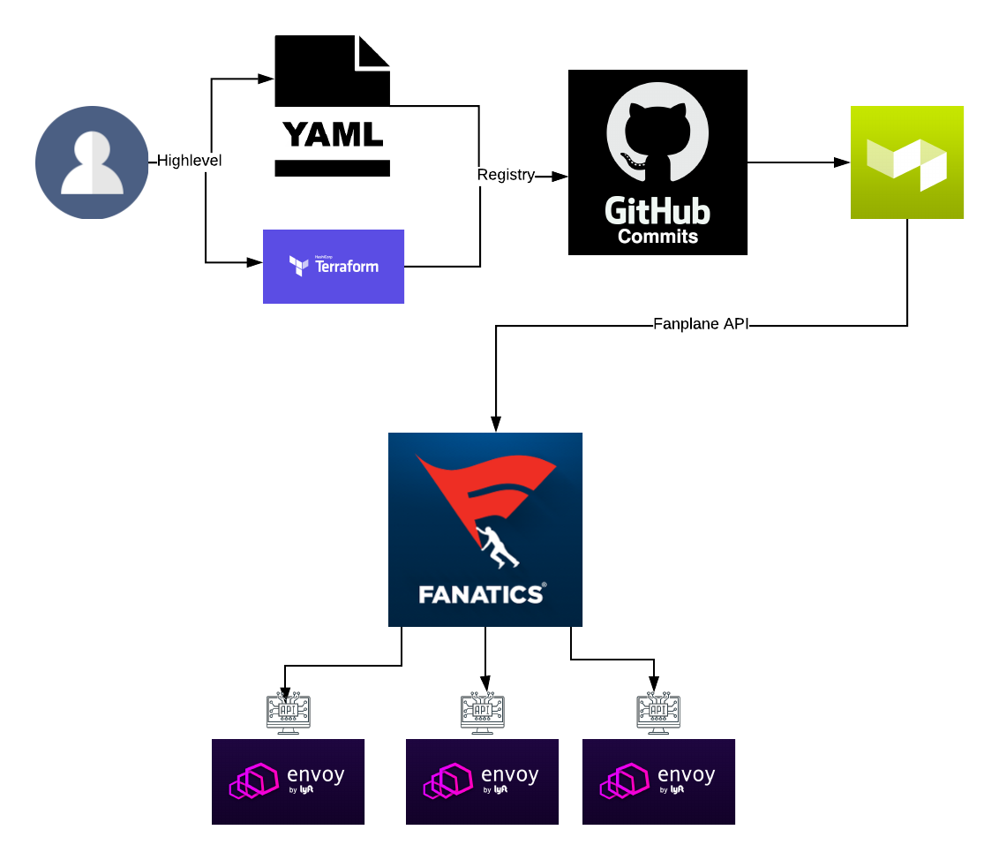

# Fanatics Envoy Control Plane

Fanplane provides a simple way to control envoy's sidecar configuration. It makes possible to tweak low level envoy
configuration and use xDS interface.


## Fanplane Flow

The idea behind Fanplane is that all configurations of the sidecars are managed by a centralized registry in VCS using GitOps.
With the model in place in the registry we could use then kubectl apply or terraform apply to
ship the desired configuration inside each envoy sidecar

[Registry](https://buildkite.com/fanatics/ccp-registry)

[Buildkite](https://buildkite.com/fanatics/ccp-registry/builds/4)



## Reference
Fanplane uses kubernetes CustomResourceDefinitions to ship
envoy configuration into sidecars.

## Quick start
```
$ fanplane -c mesh.yaml -p 18000 -l info
```

## Development
Fanplane uses kubernetes crds toolset to generate clients and crd definition
For update the model use:

```
$ ./hack/update_codegen.sh
```
To generate go-client and deepcopy
